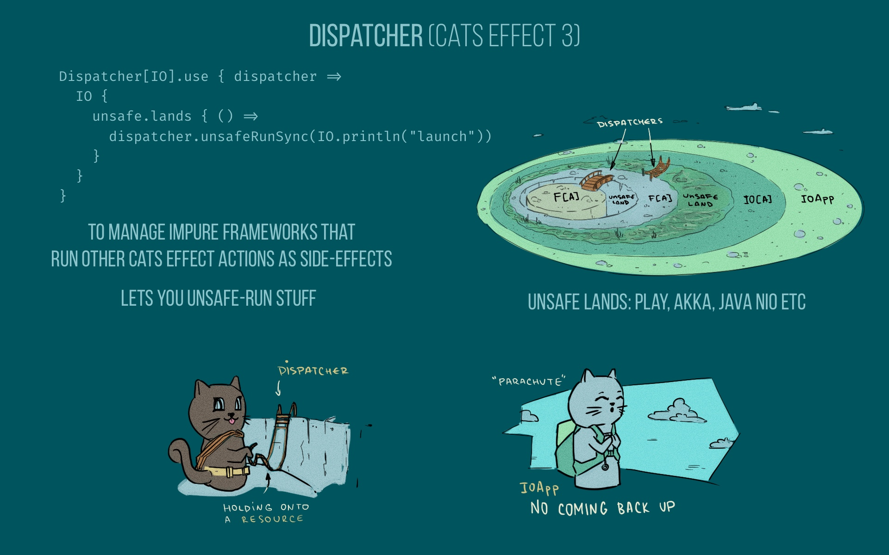

## Motivation

Users of cats effect 2 may be familiar with the `Effect` and `ConcurrentEffect`
typeclasses. These have been removed as they contrained implementations of the
typeclasses too much by forcing them to be embeddable in `IO` via `def
toIO[A](fa: F[A]): IO[A]`. However, these typeclasses also had a valid use-case
for unsafe running of effects to interface with impure APIs (`Future`, `NIO`,
etc).

## Dispatcher

`Dispatcher` addresses this use-case but can be constructed for any effect
type with an `Async` instance, rather than requiring a primitive typeclass
implementation.

```scala

trait Dispatcher[F[_]] extends DispatcherPlatform[F] {

  def unsafeToFutureCancelable[A](fa: F[A]): (Future[A], () => Future[Unit])

  def unsafeToFuture[A](fa: F[A]): Future[A] =
    unsafeToFutureCancelable(fa)._1

  def unsafeRunCancelable[A](fa: F[A]): () => Future[Unit] =
    unsafeToFutureCancelable(fa)._2

  def unsafeRunAndForget[A](fa: F[A]): Unit = {
    unsafeToFutureCancelable(fa)
    ()
  }

  //Only on the JVM
  def unsafeRunSync[A](fa: F[A]): A
}
```

An instance of `Dispatcher` is very cheap - it allocates a single fiber so it
is encouraged to instantiate it where necessary rather than wiring
a single instance throughout an application.
